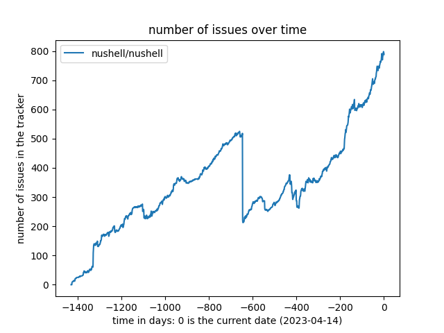

# nu-issue-tracker
A nushell tool to keep track of the issue tracker over time.

## get the previous history of repositories
if you want to keep track of the issue tracker from the beginning of the
history of a project, but do not have all the issue counts over time, you
can follow the procedure below:
```nushell
use mod.nu *

# pull the main `nushell` repos
[
    "nushell/nushell"
    "nushell/nu-ansi-term"
    "nushell/nu_scripts"
    "nushell/nushell.github.io"
    "nushell/reedline"
] | each {|repo| get issues $repo --from 1}

# `nushell/nushell` has so many pages, we can only pull the first 59 at once :eyes:
get issues "nushell/nushell" --from 60  # some time later

# gather the issues together in a single NUON file per repository
ls nushell/ | get name | each {|repo|
    gather issues $repo | select number created_at closed_at | save ({
        parent: $repo
        stem: "issues"
        extension: "nuon"
    } | path join)
}

# save the full history files
for repo in (ls nushell/ | get name) {
    print $"(ansi erase_line)building history of ($repo)"

    {
        parent: $repo
        stem: "issues"
        extension: "nuon"
    } | path join
    | open
    | build history
    | save ({
        parent: $repo
        stem: "history"
        extension: "nuon"
    } | path join)
}
```

## generate the figures
```bash
for repo in (ls nushell/ | get name) {
    print -n $"(ansi erase_line)generating figure of ($repo)\r"

    python plot.py $repo (
        {
            parent: $repo
            stem: "history"
            extension: "nuon"
        } | path join
        | open
        | upsert when {|it|
            $it.date - (date now)
            | into duration --convert day
            | str replace " day" ""
            | into decimal
            | math round
        }
        | to json
    ) (
        date now | date format "%Y-%m-%d"
    ) ({
        parent: $repo
        stem: "history"
        extension: "png"
    } | path join)
}
```

## the issue trackers

### nushell/nushell

